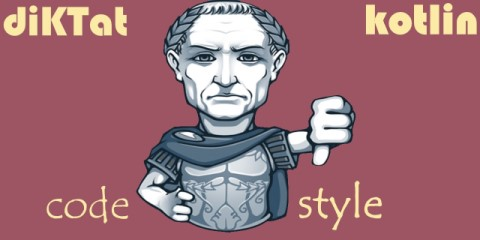

[](https://app.fossa.com/projects/git%2Bgithub.com%2Fakuleshov7%2FdiKTat?ref=badge_shield)
[](https://github.com/KotlinBy/awesome-kotlin)
[](https://ktlint.github.io/)
[](https://t.me/joinchat/AAAAAFDg-ipuZFGyBGPPeg)
[](https://hitsofcode.com/view/github/akuleshov7/diktat)
[](https://codecov.io/gh/akuleshov7/diKTat)

## diKTat project
### What is diKTat
diKTat ([github](https://github.com/akuleshov7/diKTat)) - is a rule set of Kotlin code style rules that are using [KTlint](https://ktlint.github.io/) framework under the hood.
In this project we are trying to define Kotlin code style rules and implement them as visitors for AST tree provided by Ktlint.
It will detect (check) and fix code style issues based on [diKTat Kotlin codestyle](https://github.com/akuleshov7/diKTat/wiki/diKTat-codestyle-guide).

### What was hacked and changed in KTlint and why do we temporary need a fork of it?
Mainly we wanted to create a common configurable mechanism that will give us a chance to enable/disable and customize all rules.
That's why we added logic for:
1) Parsing .json file with configurations of rules and passing it to visitors
2) Passing information about properties to visitors. This information is very useful, when you are trying to get, for example, a filename of file where the code is stored.
3) We added a bunch of visitors that will extended KTlint functionaliity

## Usage
diKTat uses KTlint framework so see it's [usage first](https://ktlint.github.io/)

### How to: run default configuration of diKTat as CLI application
load KTlint: 
```shell script
curl -sSLO https://github.com/pinterest/ktlint/releases/download/0.37.2/ktlint && chmod a+x ktlint`
```
you can also download ktlint manually from [ktlint project repo](https://github.com/pinterest/ktlint/releases)
another option for MacOS is `brew install ktlint`

load diKTat: 
```shell script
curl -sSLO https://central.artipie.com/akuleshov7/diktat/org/cqfn/diktat/diktat-rules/0.0.1/diktat-rules-0.0.1-jar-with-dependencies.jar
```

run KTlint with diKTat injected: 
```shell script
./ktlint -R diktat-rules-0.0.1-jar-with-dependencies.jar "src/test/**/*.kt"
```

this will run the default configuration of diKTat in check mode. To start autofixing use `-F` option. \
To see any reference related to ktlint - see: [KTlint](https://ktlint.github.io/) or use: 
`./ktlint -help`

### How to: run default configuration of diKTat with maven plugin
add this snippet to your pom.xml `<build>` section: 
```xml
          <plugin>
                <groupId>org.apache.maven.plugins</groupId>
                <artifactId>maven-antrun-plugin</artifactId>
                <version>1.8</version>
                <executions>
                    <execution>
                        <id>ktlint</id>
                        <phase>verify</phase>
                        <configuration>
                            <target name="ktlint">
                                <java taskname="ktlint" dir="${basedir}" fork="true" failonerror="true"
                                      classpathref="maven.plugin.classpath" classname="com.pinterest.ktlint.Main">
                                    <arg value="src/**/*.kt"/>
                                </java>
                            </target>
                        </configuration>
                        <goals>
                            <goal>run</goal>
                        </goals>
                    </execution>
                </executions>
                <dependencies>
                    <dependency>
                        <groupId>com.pinterest</groupId>
                        <artifactId>ktlint</artifactId>
                        <version>0.37.2</version>
                    </dependency>
                    <dependency>
                        <groupId>org.cqfn.diktat</groupId>
                        <artifactId>diktat-rules</artifactId>
                        <version>0.0.1-SNAPSHOT</version>
                    </dependency>
                </dependencies>
            </plugin>
```

in case you want to add autofixer with diktat ruleset just extend the snippet above with: `<arg value="-F"/>
`

### How to: make deep customization of diKTat (rules-config.json)
In ktlint rules can be configured via .editorconfig, but this does not give a chance to customize or enable/disable each and every rule independently.
That is why we have supported `rules-config.json` that can be easily changed and help in customization of your own rule set. 
It has simple fields: "name" - name of the rule, "enabled" (true/false) to enable or disable that rule and "configuration" - a simple map of some extra unique configurations for the rule, for example: 
```json
 "configuration": {
      "isCopyrightMandatory": true,
      "copyrightText": "Copyright (c) Huawei Technologies Co., Ltd. 2012-2020. All rights reserved."
    }
```

To see all list of available configurations go to our wiki: [Available inspections](https://github.com/akuleshov7/diKTat/wiki/Available-inspections-supported-in-diktat)

## Development
### Main components
Main components are:
1) diktat-ruleset - number of rules that are supported by diKTat
2) diktat-test-framework - functional/unit test framework that can be used for running your code fixer on the initial code and compare it with the expected result
3) also see our demo: diktat-demo in a separate repository

### How to: build the project
Download:
```shell script
git clone https://github.com/akuleshov7/diKTat.git
```

We are using maven as we tired of Gradle:
```shell script
mvn clean install
```

This will also install git hooks into your local .git directory. The hooks will restrict commit messages and branch naming.

### Contribution policy
Please follow our [contributing policy](https://github.com/akuleshov7/diKTat/wiki/Contributing-policy)
