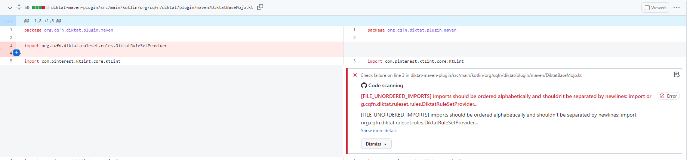

[](https://codecov.io/gh/saveourtool/diKTat)

[](https://github.com/saveourtool/diKTat/releases)
[](https://mvnrepository.com/artifact/com.saveourtool.diktat)
[](https://app.fossa.com/projects/git%2Bgithub.com%2Fsaveourtool%2Fdiktat?ref=badge_shield)
[](https://t.me/diktat_help)

[](https://hitsofcode.com/view/github/saveourtool/diktat)


[](https://github.com/KotlinBy/awesome-kotlin)


DiKTat is a strict [coding standard ](info/guide/diktat-coding-convention.md) for Kotlin and a collection of [Kotlin](https://kotlinlang.org/) code style rules implemented
as AST visitors on the top of [KTlint](https://ktlint.github.io/). It can be used for detecting and autofixing code smells in CI/CD process.
The full list of available supported rules and inspections can be found [here](info/available-rules.md).

Now diKTat was already added to the lists of [static analysis tools](https://github.com/analysis-tools-dev/static-analysis), to [kotlin-awesome](https://github.com/KotlinBy/awesome-kotlin) and to [kompar](https://catalog.kompar.tools/Analyzer/diKTat/1.2.5). Thanks to the community for this support!

## See first

|  |  |  |  |  |  |
| --- | --- | --- | --- | --- | --- |
|[Codestyle](info/guide/diktat-coding-convention.md)|[Inspections](info/available-rules.md) | [Examples](examples) | [Demo](https://saveourtool.com/#/demo/diktat) | [White Paper](wp/wp.pdf) | [Groups of Inspections](info/rules-mapping.md) |

## Why should I use diktat in my CI/CD?

There are several tools like `detekt` and `ktlint` that are doing static analysis. Why do I need diktat?

First of all - actually you can combine diktat with any other static analyzers. And diKTat is even using ktlint framework for parsing the code into the AST.
Main features of diktat are the following:

1) **More inspections.** It has 100+ inspections that are tightly coupled with it's [Codestyle](info/guide/diktat-coding-convention.md).

2) **Unique [Inspections](info/available-rules.md)** that are missing in other linters.

3) **Highly configurable**. Each and every inspection can be [configured](#config) or [suppressed](#suppress).

4) **Strict detailed [Codestyle](info/guide/diktat-coding-convention.md)** that you can adopt and use in your project.

## Run as CLI-application

[Info](diktat-cli/diktat-cli.adoc)

### Download binary

1. Download diKTat manually: [here](https://github.com/saveourtool/diktat/releases)

   **OR** use `curl`:
   ```shell
   curl -sSLO https://github.com/saveourtool/diktat/releases/download/v2.0.0/diktat && chmod a+x diktat
   ```

### Run diKTat

Finally, run KTlint (with diKTat injected) to check your '*.kt' files in 'dir/your/dir':

```console
$ ./diktat "dir/your/dir/**/*.kt"
```

To **autofix** all code style violations, use `--mode fix` option.

## Run with Maven using diktat-maven-plugin
:heavy_exclamation_mark: If you are using **Java 16+**, you need to add `--add-opens java.base/java.util=ALL-UNNAMED --add-opens=java.base/java.lang=ALL-UNNAMED` flag to the JVM. For more information, see: https://github.com/pinterest/ktlint/issues/1195
This can be done by setting `MAVEN_OPTS` variable:

```
export MAVEN_OPTS="--add-opens java.base/java.util=ALL-UNNAMED --add-opens=java.base/java.lang=ALL-UNNAMED"
```

This plugin is available since version 0.1.3. You can see how it is configured in our examples for self-checks: [examples](examples/maven/pom.xml).
If you use it and encounter any problems, feel free to open issues on [github](https://github.com/saveourtool/diktat/issues).

<details>
<summary>Add this plugin to your pom.xml:</summary>

```xml
            <plugin>
                <groupId>com.saveourtool.diktat</groupId>
                <artifactId>diktat-maven-plugin</artifactId>
                <version>${diktat.version}</version>
                <executions>
                    <execution>
                        <id>diktat</id>
                        <phase>none</phase>
                        <goals>
                            <goal>check</goal>
                            <goal>fix</goal>
                        </goals>
                        <configuration>
                            <inputs>
                                <input>${project.basedir}/src/main/kotlin</input>
                                <input>${project.basedir}/src/test/kotlin</input>
                            </inputs>
                            <diktatConfigFile>diktat-analysis.yml</diktatConfigFile>
                           <excludes>
                              <exclude>${project.basedir}/src/test/kotlin/excluded</exclude>
                           </excludes>
                        </configuration>
                    </execution>
                </executions>
            </plugin>
```
</details>

To run diktat in **only-check** mode use command `$ mvn diktat:check@diktat`.
To run diktat in **autocorrect** mode use command `$ mvn diktat:fix@diktat`.

Requesting a specific _Maven_ `executionId` on the command line (the trailing
`diktat` in the above example) may be essential in these cases:

  * In your `pom.xml`, you have multiple executions with different
    configurations (e. g.: multiple rule sets):
    <details>

    ```xml
    <executions>

        <execution>
            <id>diktat-basic</id>
            <configuration>
                <diktatConfigFile>diktat-analysis.yml</diktatConfigFile>
            </configuration>
        </execution>

        <execution>
            <id>diktat-advanced</id>
            <configuration>
                <diktatConfigFile>diktat-analysis-advanced.yml</diktatConfigFile>
            </configuration>
        </execution>

    </executions>
    ```
    </details>
  * Your YAML file with DiKTat rules has a non-default name and/or resides in a
    non-default location:
    <details>

    ```xml
    <executions>
        <execution>
            <id>diktat</id>
            <configuration>
                <diktatConfigFile>/non/default/rule-set-file.yml</diktatConfigFile>
            </configuration>
        </execution>
    </executions>
    ```
    </details>

If you omit the `executionId`:

```console
$ mvn diktat:check
```

&mdash; the plug-in will use the default configuration and search for
`diktat-analysis.yml` file in the project directory (you can still customize the
rule sets by editing the YAML file).

## Run with Gradle using diktat-gradle-plugin
Requires a gradle version no lower than 5.3.

This plugin is available since version 0.1.5. You can see how the plugin is configured in our examples: [build.gradle.kts](examples/gradle-kotlin-dsl/build.gradle.kts).

<details>
<summary>Add this plugin to your `build.gradle.kts`:</summary>

```kotlin
plugins {
    id("com.saveourtool.diktat.diktat-gradle-plugin") version "1.2.5"
}
```

Or use buildscript syntax:
```kotlin
buildscript {
    repositories {
        mavenCentral()
    }
    dependencies {
        classpath("com.saveourtool.diktat:diktat-gradle-plugin:1.2.5")
    }
}

apply(plugin = "com.saveourtool.diktat.diktat-gradle-plugin")
```

You can then configure diktat using `diktat` extension:
```kotlin
diktat {
    inputs {
        include("src/**/*.kt")  // path matching this pattern (per PatternFilterable) that will be checked by diktat
        exclude("src/test/kotlin/excluded/**")  // path matching this pattern will not be checked by diktat
    }
    debug = true  // turn on debug logging
}
```

Also in `diktat` extension you can configure different reporters and their output. You can specify `json`, `html`, `sarif`, `plain` (default).
If `output` is set, it should be a file path. If not set, results will be printed to stdout.
```kotlin
diktat {
    // since 1.2.5 to keep in line with maven properties
    reporter = "json" // "html", "json", "plain" (default), "sarif"
    // before 1.2.5
    // reporterType = "json" // "html", "json", "plain" (default), "sarif"

    output = "someFile.json"
}
```

</details>

You can run diktat checks using task `diktatCheck` and automatically fix errors with tasks `diktatFix`.

## Run with Spotless
[Spotless](https://github.com/diffplug/spotless) is a linter aggregator.

### Gradle
Diktat can be run via spotless-gradle-plugin since version 5.10.0

<details>
<summary>Add this plugin to your build.gradle.kts</summary>

```kotlin
plugins {
   id("com.diffplug.spotless") version "5.10.0"
}

spotless {
   kotlin {
      diktat()
   }
   kotlinGradle {
      diktat()
   }
}
```
</details>

<details>
<summary>You can provide a version and configuration path manually as configFile.</summary>

```kotlin
spotless {
   kotlin {
      diktat("1.2.5").configFile("full/path/to/diktat-analysis.yml")
   }
}
```
</details>

### Maven
Diktat can be run via spotless-maven-plugin since version 2.8.0

<details>
<summary>Add this plugin to your pom.xml</summary>

```xml
<plugin>
   <groupId>com.diffplug.spotless</groupId>
   <artifactId>spotless-maven-plugin</artifactId>
   <version>${spotless.version}</version>
   <configuration>
      <kotlin>
         <diktat />
      </kotlin>
   </configuration>
</plugin>
```
</details>

<details>
<summary>You can provide a version and configuration path manually as configFile</summary>

```xml
<diktat>
  <version>1.2.5</version> <!-- optional -->
  <configFile>full/path/to/diktat-analysis.yml</configFile> <!-- optional, configuration file path -->
</diktat>
```
</details>

## GitHub Integration
We suggest everyone to use common ["sarif"](https://docs.oasis-open.org/sarif/sarif/v2.0/sarif-v2.0.html) format as a `reporter` (`reporterType`)  in CI/CD.
GitHub has an [integration](https://docs.github.com/en/code-security/code-scanning/integrating-with-code-scanning/sarif-support-for-code-scanning)
with SARIF format and provides you a native reporting of diktat issues in Pull Requests.



<details>
<summary> Github Integration</summary>
1) Add the following configuration to your project's setup for GitHub Actions:

Gradle Plugin:
```text
    githubActions = true
```

Maven Plugin (pom.xml):
```xml
    <githubActions>true</githubActions>
```

Maven Plugin (cli options):
```text
mvn -B diktat:check@diktat -Ddiktat.githubActions=true
```

2) Add the following code to your GitHub Action to upload diktat SARIF report (after it was generated):

```yml
      - name: Upload SARIF to Github using the upload-sarif action
        uses: github/codeql-action/upload-sarif@v1
        if: ${{ always() }}
        with:
          sarif_file: ${{ github.workspace }}
```

*Note*: `codeql-action/upload-sarif` limits the number of uploaded files at 15. If your project has more than 15 subprojects,
the limit will be exceeded and the step will fail. To solve this issue one can merge SARIF reports.

`diktat-gradle-plugin` provides this capability with `mergeDiktatReports` task. This task aggregates reports of all diktat tasks
of all Gradle project, which produce SARIF reports, and outputs the merged report into root project's build directory. Then this single
file can be used as an input for Github action:
```yaml
with:
    sarif_file: build/reports/diktat/diktat-merged.sarif
```

</details>

## <a name="config"></a> Customizations via `diktat-analysis.yml`

In KTlint, rules can be configured via `.editorconfig`, but
this does not give a chance to customize or enable/disable
each and every rule independently.
That is why we have supported `diktat-analysis.yml` that can be easily
changed and help in customization of your own rule set.
It has simple fields:
`name` — name of the rule,
`enabled` (true/false) — to enable or disable that rule (all rules are enabled by the default),
`configuration` — a simple map of some extra unique configurations for this particular rule.
For example:

```yaml
- name: HEADER_MISSING_OR_WRONG_COPYRIGHT
  # all rules are enabled by the default. To disable add 'enabled: false' to the config.
  enabled: true
  configuration:
    isCopyrightMandatory: true
    copyrightText: Copyright (c) Jeff Lebowski, 2012-2020. All rights reserved.
```
Note, that you can specify and put `diktat-analysis.yml` that contains configuration of diktat in the parent directory of your project on the same level where `build.gradle/pom.xml` is stored. \
See default configuration in [diktat-analysis.yml](diktat-rules/src/main/resources/diktat-analysis.yml) \
Also see [the list of all rules supported by diKTat](info/available-rules.md).


## <a name="suppress"></a> Suppress warnings/inspections

<details>
<summary>Suppress warnings on individual code blocks</summary>
In addition to enabling/disabling warning globally via config file (`enable = false`), you can suppress warnings
by adding `@Suppress` annotation on individual code blocks or `@file:Suppress()` annotation on a file-level.

For example:

``` kotlin
@Suppress("FUNCTION_NAME_INCORRECT_CASE")
class SomeClass {
    fun methODTREE(): String {

    }
}
```
</details>

<details>
<summary>Disable all inspections on selected code blocks</summary>
Also you can suppress **all** warnings by adding `@Suppress("diktat")` annotation on individual code blocks.

For example:

``` kotlin
@Suppress("diktat")
class SomeClass {
    fun methODTREE(): String {

    }
}
```
</details>

<details>
<summary>ignoreAnnotated: disable inspections on blocks with predefined annotation</summary>
In the `diktat-analysis.yml` file for each inspection it is possible to define a list of annotations that will cause
disabling of the inspection on that particular code block:

```yaml
- name: HEADER_NOT_BEFORE_PACKAGE
  enabled: true
  ignoreAnnotated: [MyAnnotation, Compose, Controller]
```
</details>

<details>
<summary>Suppress groups of inspections by chapters</summary>
It is easy to suppress even groups of inspections in diKTat.

These groups are linked to chapters of [Codestyle](info/guide/diktat-coding-convention.md).

To disable chapters, you will need to add the following configuration to common configuration (`- name: DIKTAT_COMMON`):
```yaml
    disabledChapters: "1, 2, 3"
```

Mapping of inspections to chapters can be found in [Groups of Inspections](info/rules-mapping.md).
</details>

## Running against the baseline
When setting up code style analysis on a large existing project, one often doesn't have an ability to fix all findings at once.
To allow gradual adoption, diktat and ktlint support baseline mode. When running ktlint for the first time with active baseline,
the baseline file will be generated. It is a xml file with a complete list of findings by the tool. On later invocations,
only the findings that are not in the baseline file will be reported. Baseline can be activated with CLI flag:
```bash
java -jar ktlint -R diktat.jar --baseline=diktat-baseline.xml **/*.kt
```
or with corresponding configuration options in maven or gradle plugins. Baseline report is intended to be added into the VCS,
but it can be removed and re-generated later, if needed.

## Contribution
See our [Contributing Policy](CONTRIBUTING.md) and [Code of Conduct](CODE_OF_CONDUCT.md)
